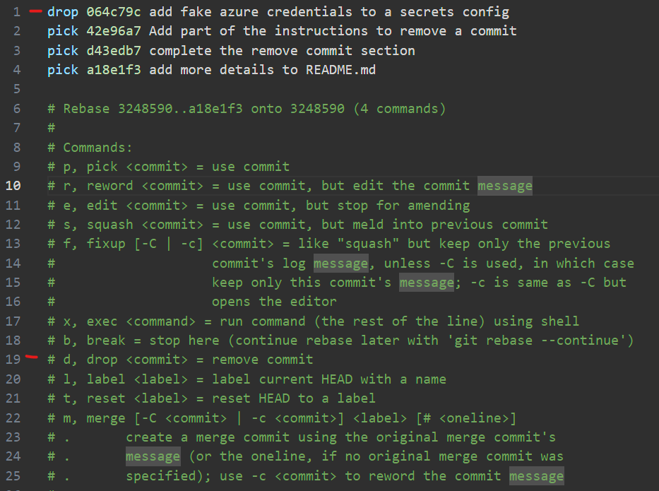

# Git Rebase Interactive Tutorial
This is an interactive tutorial on how to use the ```git rebase -i``` command to do the following:
- delete an unwanted commit
- squash/combine multiple commits
- edit an old commit message

## Warning about Git Rebase
```git rebase``` is a "destructive" command. While old commits can be found in the reflog, 
the actions in this tutorial will often give new your commits new id hashes and will rewrite
the history of your branch. It's often a good idea to make a backup branch when you are new 
to interactive rebase.

It is also advised to not manipulate your git history for anything that has already been 
distributed to others via a remote branch. It is best used locally to clean up work you are
intending to commit in a pull request.

## Getting Started
To get started, you will want to clone this repository to your local machine. 
If you need help on this step, consult the
[github documentation on cloning a repository](https://docs.github.com/en/repositories/creating-and-managing-repositories/cloning-a-repository).

Once you have the repository cloned to your local machine, you will need to open a terminal and navigate to 
your working directory.

- **On Windows**, I recommend ```Terminal``` using ```Powershell```. This comes out of the box with Windows 10+.
- **On Mac**, I recommend [iTerm2](https://iterm2.com/). 
I have a tutorial on [setting up a better terminal on macOS](https://davidboothe.com/a-better-terminal-on-mac-os/)
- **On Linux**, your life is terminal (and i don't mean ending, HAHA) so pick your own option.

## Git Rebase General Tips
- Commits will be listed in reverse order. The oldest commit starts at the top.
- `git rebase` will open your default text editor as specified in your git settings. 
  [You can change this to something like VS Code if you want](https://stackoverflow.com/questions/30024353/how-to-use-visual-studio-code-as-default-editor-for-git).
- You can use a commit hash or `HEAD~#` notation, where # is the number of commits from HEAD
  - example: `HEAD~3` would be the top 3 commits
- If you run into conflicts you can use `git rebase --abort` or `git rebase --continue`
  like you would with a the `merge` command.

## Delete an Unwanted Commit
Say you have a commit deeper in your commit history that you really don't want to push up
to everyone else working on your code base. You can use ```git rebase -i``` to alter 
the commit history and remove the unwanted commit before creating a PR.

### Identify the commit that we want to remove
Use the following command and look for the comment about adding azure credentials
```bash
git log -v
```
[insert picture here]

Now grab the hash of the commit AFTER the one we want to remove. 
You shouldn't need the whole thing, but the hash you are looking for should be
`3248590cd963d04618f734383c6d98db2a177132`

### Rebase Interactively
Add this hash to our rebase command

```bash
git rebase -i 3248590cd963d04618f734383c6d98db2a177132
```
Git should prompt you with the default git editor. [I've made mine VS Code](https://stackoverflow.com/questions/30024353/how-to-use-visual-studio-code-as-default-editor-for-git)



You'll notice that it gives a big help section to help you determine how to use the 
interactive rebase command. For this scenario, we will use `drop` on the azure credential
commit that we want to remove.

Save the changes, check your git log again. You should notice the offending commit
and it's file changes are gone completely. 

## Squash / Combine Multiple Commits
Now let's say you were writing this wonderful tutorial and you committed your work
several times through out the day. But now you want to squash all the random commits
to be a single commit that represents the unit of work better.

### Identify all the commits to squash
Before we can squash commits, we need to identify a window of commits that we want to 
squash. Let's use the log to review our commits.

```bash
git log -v
```

Let's go down to the commit with the comment `Add getting started section to README.md`

We've identified the commit we want, but just like when deleting a commit we need to
take the hash from the commit after it. That hash should be `6ccd40e1ee9228131fe8f0150a2e994347bbca1d`

### Rebase Interactively
Now that we found the window we want, let's `rebase` back to that starting commit.

```bash
git rebase -i 6ccd40e1ee9228131fe8f0150a2e994347bbca1d 
```

[use image here]

here we will use the `squash` command, which will combine the marked commit with 
the line directly above. Remember, the order is reversed, so the previous commit
is above.

Go ahead and squash some of the commits dealing with the readme file

## Edit An Old Commit Message
Now say you squashed some commits, but now the message isn't exactly what you want.
This is easy. Let's use the `rebase` command again, but this time we will use the 
`HEAD~#` notation.

```bash
git rebase -i HEAD~3
```

This will open an editor with the last 3 commits

Use the `reword` command on one of these commits. You may be tempted to change the
commit message right here, but part is only meant for actions we wish to take.

[INSERT IMAGE HERE]

Click save and close your editor. You will then be met with another editor that
will actually let you change the commit message.

[INSERT IMAGE HERE]

After you've saved and closed this new window, you can review your logs to see
that the message has indeed changed.

##Conclusion
And with that you've just scratched the surface using `git rebase`. Hopefully you
find these commands useful for when you want to alter your git history before a PR.
